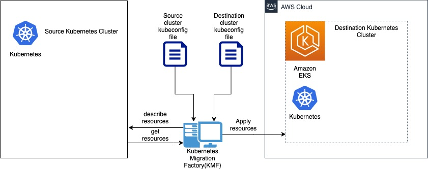
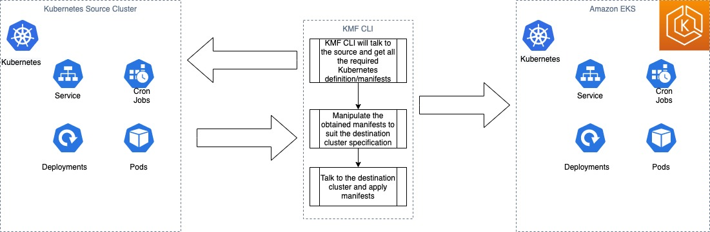

# Kubernetes Migration Factory User Guide

Kubernetes Migrations Factory (KMF) is a tool developed for migrating docker containers to Amazon EKS. KMF is written in [Golang](https://golang.org/) and offers command line interface. The Kubernetes Migration Factory solution is an orchestration platform for migrating containers to Amazon EKS at
scale. It is designed to coordinate and automate many of the manual processes, eliminating human error and speeding migration phases down to minutes from weeks of planning and data collection. With just a few inputs provided to the KMF command line interface(CLI), customers will be able to set, launch, and track the migration plan for their current container platform configuration into Amazon EKS. This solution is able to scan the source platform and generate a blueprint of the running workload. After the scan is done, you can also see list of all the Kubernetes resources that will be created onthe destination. This solution is built to understand the source platform implementation details and then manipulate the obtained manifest files such that it is valid and accepted by the destination Kubernetes implementation, Amazon EKS. It is able to provide recommendations to add relevant AWS native services by determining the type of services used in the source and finding a similar type of AWS resources. The solution will enable the customer with autonomous recommendation for their data plane setup based on their current cluster meta data.

### **Architecture**




Kubernetes Migration Factory (KMF) tool can be used to migrate Kubernetes resources from a Kubernetes cluster running anywhere(1) to Amazon EKS via a Command Line Interface(CLI). It can run on a server that can authenticate to the source Kubernetes cluster and target Kubernetes cluster, which is Amazon EKS in this case. 

### **Prerequisites**

* This tool migrates from any Kubernetes cluster to Amazon EKS, so it needs a destination EKS Cluster. For more information, please refer [Creating an Amazon EKS Cluster](https://docs.aws.amazon.com/eks/latest/userguide/create-cluster.html) documentation
* On the workstation where the KMF CLI will be used,  setup the kubeconfig for the destination cluster. For more information on authenticating and accessing an Amazon EKS cluster, please refer to [Cluster Authentication](https://docs.aws.amazon.com/eks/latest/userguide/managing-auth.html) documentation
* Setup kubeconfig file to access the EKS Cluster using the kubectl tool and the same setup is sufficient for KMF to get access. Please refer [setting kubeconfig file for EKS cluster access](https://docs.aws.amazon.com/eks/latest/userguide/create-kubeconfig.html) documentation
* Similarly setup the kubeconfig file for the source Kubernetes cluster. For Google Kubernetes Engine(GKE), you may refer [cluster access to GKE](https://cloud.google.com/kubernetes-engine/docs/how-to/cluster-access-for-kubectl) just like how you setup access for kubectl tool
* Download `KMF` for your platform from here [TO COME]. If your platform is not among the available releases, you can install GoLang and setup the workspace. Please refer [Download and Install](https://golang.org/doc/install) for more information about installing golang to your workstation
* Amazon EKS Cluster used as destination for migrating the Kubernetes workload should have access to the docker registry used in the source. You may follow the documentation [Pull an Image from a Private Registry
](https://kubernetes.io/docs/tasks/configure-pod-container/pull-image-private-registry/). If you create the secret for private registry access in the source kubernetes cluster and also attach to all the container specifications in all resources, kubernetes migration factory will migrate that as well
* KMF tool also helps to migrate images from 3rd party repositories such as GCR, Dockerhub, Gitlab private registry to Amazon Elastic Container Registry. On the workstation where the KMF CLI will be used, ensure to setup docker login for Amazon ECR and also add docker login to list of supported repositories (GCR, Gitlab, Dockerhub) that are intended for migration prior to executing KMF
* KMF tool uses aws privileges assigned to the execution id in order to create Amazon elastic container registry and push images to it. The following IAM policy statement is the minimum required permission

        {
            "Version":"2012-10-17",
            "Statement":[
            {
                "Sid":"ListImagesInRepository",
                "Effect":"Allow",
                "Action":[
                    "ecr:ListImages"
                ],
                "Resource":"arn:aws:ecr:<AWS-REGION>:<AWS-ACCOUNT>:repository/*"
            },
            {
                "Sid":"GetAuthorizationToken",
                "Effect":"Allow",
                "Action":[
                    "ecr:GetAuthorizationToken"
                ],
                "Resource":"*"
            },
            {
                "Sid":"ManageRepositoryContents",
                "Effect":"Allow",
                "Action":[
                        "ecr:BatchCheckLayerAvailability",
                        "ecr:GetDownloadUrlForLayer",
                        "ecr:GetRepositoryPolicy",
                        "ecr:DescribeRepositories",
                        "ecr:ListImages",
                        "ecr:DescribeImages",
                        "ecr:BatchGetImage",
                        "ecr:InitiateLayerUpload",
                        "ecr:UploadLayerPart",
                        "ecr:CompleteLayerUpload",
                        "ecr:PutImage"
                ],
                "Resource":"arn:aws:ecr:<AWS-REGION>:<AWS-ACCOUNT>:repository/*"
            }
            ]
        }

### **KMF CLI Setup**

**Use an already build binary:**
 **Steps:**

1. Download KMF CLI for your os from the release section to your workstation where you have authenticated to both source and destination clusters. There are compiled binaries for Mac OS, Linux and Windows operating system. 
* For Mac OS, the binary name is kmf_mac. This document is narrated to reference binary by the name kmf, hence edit the commands accrodingly.
* For Linux OS, the binary name is kmf.
* For Windows OS, the binary name kmf.exe. This document is narrated to reference binary by the name kmf, hence edit the commands accrodingly.

**Note**: The compiled binaries for 64 bit executables with GOARCH=amd64
go build commands used are as below for compilation: 

For linux: ```CGO_ENABLED=0 GOOS=linux GOARCH=amd64 go build -o ./bin/linux/kmf```

For windows ```CGO_ENABLED=0 GOOS=windows GOARCH=amd64 go build -o ./bin/windows/kmf.exe```

For mac ```go build -o ./bin/mac/kmf``` since it was compiled on a mac machine.

For more information you may refer [cross-compiling made easy with Golang](https://opensource.com/article/21/1/go-cross-compiling) documentation

2. Optional: Add the tool to your OS PATH


**Building the binary from source: 
    Steps:**

1. Clone the kubernetes-migration-factory repository
2. Change directory to containers-migration-factory

```
$cd kubernetes-migration-factory/
```

1. Run the below command to build the binary for the KMF

```
$go build
```

The above command will build the binary for KMF CLI within current directory to a file named `containers-migration-factory`
If you want this to be a shorter name say `kmf`, then run the command as below:

```
$go build -o ./bin/kmf
```

### **Running KMF CLI:**
### **Running with a Config config.ini**
From the operating system path from where you are making calls to ./bin/kmf, make sure that you have a file with the name exactly called [config.ini](/config.ini) and provide all the required information. A sample config.ini file looks like below:

`Explanation for each parameter is provided in the config.ini file as comments.`

```
[COMMON]
# common configuration params required for migration.
# Local path where generated helm charts to be saved
HELM_CHARTS_PATH=/Users/username/kuberenetes-pocs/helm
RESOURCES=all
# Valid Value for ACTION Deploy/Delete
ACTION=Delete
# Namespaces from which the resources need to migrated
# comma seperated list of namespace or "all"
NAMESPACES=all

[SOURCE]
# Source Cloud Provider valid values are GKE,AKE,KOPS
CLOUD=GKE
# Source kube config file
# Refer the documentation for the respective source cluster provider to create the kubeconfig file. For GKE, you may refer https://cloud.google.com/kubernetes-engine/docs/how-to/cluster-access-for-kubectl
KUBE_CONFIG=/Users/username/.kube/gcp.config
CONTEXT=<Kube-Context-Name>

[TARGET]
# Target Cloud Provider valid value is AWS only
CLOUD=AWS
# Target kube config file
# Refer the AWS documentation for creating the kubeconfig file https://docs.aws.amazon.com/eks/latest/userguide/create-kubeconfig.html
KUBE_CONFIG=/Users/username/.kube/config
CONTEXT=<Kube-Context-Name>

[MIGRATE_IMAGES]
# This section is used for passing values to the KMF CLI to perform container registry images migration to Amazon ECR and this is optional
# Do you wish to migrate images from 3rd party repositories to Amazon Elastic Container Registry? Supply either "Yes" or "No"
USERCONSENT=Yes
# Comma separated list of 3rd party registries. Tool supports migration from gcr, gitlab, dockerhub registries.
REGISTRY=GCR
```
### **Explanation of each supported parameter for the KMF CLI tool**

### **COMMON Section**
#### common configuration params required for migration

**HELM_CHARTS_PATH** (Required): Local path to store the Helm charts obtained from the source cluster 
example value /Users/username/kuberenetes-pocs/helm 


**RESOURCES** (Required): Kubernetes resources to migrate from source to destination cluster
valid values are: 
* "all" for all resources supported by KMF CLI
* Comma separated resources, for example "services, deployments, cronjobs"

**Action** (Required) : Action to perform on the destination cluster
valid values are: 
***ACTION=Delete:*** To delete the kubernetes resource matching the source cluster
Note: Use this only if it is necessary as this is a destruction feature
***Action=Deploy:*** To deploy the kubernetes resource matching the source cluster

**Namespaces** (Required): Kubernetes Namespaces from which the KMF tool should migrate resources
valid values are: "all" for migrating Kubernetes resources from all namespaces
you can also provide comma separated values of namespaces, for example if the namespaced from which your want to migrate are dev, test, stage, then this will be "dev,test,stage"

### **SOURCE Section** 
***CLOUD*** (Required): Cloud provider for the source Kubernetes cluster
Valid values: any one of GKE, AKE, KOPS

***KUBE_CONFIG*** (Required): Kubeconfig file path on the local machine for the destination cluster

***CONTEXT*** (Required): Kubeconfig context. This helps to choose the Kubernetes cluster if there is a combined kubeconfig file with multiple clusters

### **TARGET Section** 

***CLOUD*** (Required): Cloud provider for the source Kubernetes cluster
Valid values: EKS

***KUBE_CONFIG*** (Required): Kubeconfig file path on the local machine for the target cluster

***CONTEXT*** (Required): Kubeconfig context. This helps to choose the Kubernetes cluster if there is a combined kubeconfig file with multiple clusters

### **MIGRATE_IMAGES Section** 

***USERCONSENT*** (Required): User consent to migrate container images to Amazon ECR

Valid values: Yes, No

***REGISTRY*** (Required): Source container registry name. This requires the user to perform docker login to those registry on the machine where KMF-CLI is getting executed

Valid Values: gcr, gitlab, dockerhub

If any argument is missing in the config.ini file or if not using a config.ini file, follow the prompt and give all the information asked.

*NOTE: This tool supports a merged kubeconfig file with both the source and destination configurations. Use the same kubeconfig file location for source and destination when answering the prompts from the tool*

### **Some examples while interacting with KMF CLI**

```
$ ./bin/kmf
Please pass the location of source kubernetes cluster kubeconfig file: <source kubeconfig file location>
Please pass the source context: (default: <current-context>): <Leave Blank for default or source context>
Please pass comma separated list of resources to migrate from source cluster to destination cluster. For all resources enter 'all':
Please pass comma separated list of namespaces for source cluster. For all namespaces enter 'all': 
Please pass path to save Helm charts from source cluster:
Do you want to migrate images from 3rd party registries to ECR? Supply either Yes or No: 
Tool supports migration from gcr, gitlab, dockerhub registries. Please pass comma separated list of 3rd party registries: 
Please pass the location of destination EKS cluster kubeconfig file: <destination kubeconfig file location>
Please pass the destination context (default: <current-context>): <Leave Blank for default or destination context>
Please pass what action the tool needs to perform. Accepted values are Deploy or Delete :
```

Based on the information provided to the CLI, it will poll the source cluster and get the details about the Kubernetes resources. KMF evaluates the source Kubernetes objects and manipulates them to be compatible with Amazon EKS, and deploys the modified manifests to its destination. 

### **Running as one line:**

#### **Migrating all resources from all namespaces**
```
$ ./bin/kmf --source_kubeconfig  /Users/<user-name>/.kube/gcp.config \
--destination_kubeconfig /Users/<user-name>/.kube/aws.config \
--namespaces "all" \
--resources "all" \
--migrate_images "yes" \
--reg_names "gcr, dockerhub, gitlab" \
--source_context <source_kubernetes_context> \  
--destination_context <destination_kubernetes_context> \
--helm_path <local-file-system-path> \
--action Deploy
```

#### **Migrating all resources from one namespace**
```
$ ./bin/kmf --source_kubeconfig /Users/<user-name>/.kube/gcp.config \
--destination_kubeconfig /Users/<user-name>/.kube/aws.config 
--namespaces "default" \
--resources "all" \
--migrate_images "yes" \
--reg_names "gcr, dockerhub, gitlab" \
--source_context <source_kubernetes_context> \ 
--destination_context <destination_kubernetes_context> \
--helm_path <local-file-system-path> \
--action Deploy
```

#### **Migrating deployments and services from multiple namepaces**
```
$ ./bin/kmf --source_kubeconfig  \
/Users/<user-name>/.kube/gcp.config --destination_kubeconfig \
/Users/<user-name>/.kube/aws.config \
--namespaces "dev,default" \
--resources "deployment,service" \
--migrate_images "yes" \
--reg_names "gcr, dockerhub, gitlab" \
--source_context <source_kubernetes_context>  \
--destination_context <destination_kubernetes_context> \
--helm_path <local-file-system-path> \
--action Deploy
```

#### **Migrating deployment and service resources from all namespaces**
```
$ ./bin/kmf --source_kubeconfig /Users/<user-name>/.kube/gcp.config \
--destination_kubeconfig /Users/<user-name>/.kube/aws.config \
--namespaces "all" \
--resources "deployment,service" \
--migrate_images "yes" \
--reg_names "gcr, dockerhub, gitlab" \
--source_context <source_kubernetes_context>  \
--destination_context <destination_kubernetes_context> \
--helm_path <local-file-system-path> \
--action Deploy
```

### **As of this release, the following Kubernetes Resource Types are supported by KMF:**

1. Deployments
2. Services
3. ServiceAccounts
4. Roles
5. ClusterRoles
6. RoleBindings
7. ClusterRoleBindings
8. Namespaces
9. DaemonSets
10. Secrets
11. StorageClasses
12. HorizontalPodAutoScalers
13. BatchJobs
14. PodSecurityPolicies
15. MutatingWebhookConfigurations
16. ValidatingWebhookConfigurations
17. ConfigMaps
18. PersistentVolumeClaims
19. Ingresses
20. CronJobs
21. Jobs

## **KMF integration with kubernetes cluster**

KMF CLI interacts with kubernetes cluster both at source and destination by using its respective kubeconfig file. KMF loads the kubeconfig files and connected to clusters using kubernetes clientset api call. So, when it comes to integration, it is quite straight forward for customers to supply source kubeconfig and destination kubeconfig either in config.ini file or via command line arguments. 

## **Limitations:**
(1)  Currently KMF supports migrating Kubernetes resources running on Google Kubernetes Engine (GKE) to Amazon EKS. However, slight changes to the code should allow you to use it for any other Kubernetes source.

(2) KMF supports only Kubernetes resources migration, but not the data. 

## **Patching & Upgrading 3rd party tools:** 
    The list of 3rd party packages used in this tool has been listed under go.mod file. We would recommend end-users to keep track of version/feature upgrades that gets published for individual packages and decide on adopting it as they find it fit based on requirements as well as security best practice followed in their organization. Following are links to version list for each packages used,

    https://pkg.go.dev/cmd/go#hdr-Download_and_install_packages_and_dependencies - Golang package management
    https://aws.github.io/aws-sdk-go-v2/docs/ - aws sdk for go
    https://github.com/kubernetes/client-go - K8S Client go versioning
    https://pkg.go.dev/github.com/bigkevmcd/go-configparser@v0.0.0-20210106142102-909504547ead?tab=versions - Go configparse
    https://pkg.go.dev/github.com/ghodss/yaml@v1.0.0?tab=versions - Go yaml
    https://pkg.go.dev/github.com/gofrs/flock@v0.8.0?tab=versions - Go flock
    https://pkg.go.dev/github.com/pkg/errors@v0.9.1?tab=versions - Go errors
    https://pkg.go.dev/gopkg.in/yaml.v2@v2.3.0?tab=versions - Go yaml.v2
    https://pkg.go.dev/gopkg.in/yaml.v3@v3.0.0-20200313102051-9f266ea9e77c?tab=versions - Go yaml.v3
    https://pkg.go.dev/helm.sh/helm/v3@v3.5.3?tab=versions - Go helm
    https://pkg.go.dev/k8s.io/api@v0.20.5 - k8s api
    https://pkg.go.dev/k8s.io/apimachinery@v0.20.5?tab=versions - k8s apimachinery
    https://pkg.go.dev/k8s.io/client-go@v0.20.5?tab=versions - k8s client-go
    https://pkg.go.dev/github.com/docker/docker@v20.10.12+incompatible?tab=versions - Docker
    https://pkg.go.dev/github.com/docker/distribution - Docker distribution

 Note: End-users should recompile the code if there is a change in package version. You can follow the procedure shared in "https://freshman.tech/snippets/go/cross-compile-go-programs/" to package based on their hardware architecture and operating system.

 ## **Roadmap:**
* Support for Custom Resource Definition(CRD)
* Support for other cloud providers Kubernetes clusters
* Support for on-prem Kubernetes clusters
* Support for data migrations
